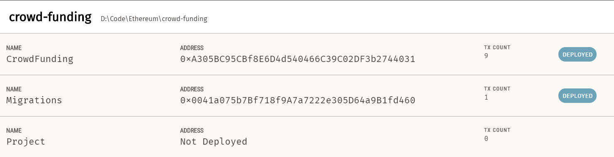

# Crowd Funding

Crowd Funding is a distributed crowdfunding web platform, which is based on React web framework and solidity implemented smart contracts. On this platform, users can anonymously create crowdfunding projects, create draw requests, contribute to crowdfunding projects and vote for the draw requests.

## Build

First, install [MetaMask](https://metamask.io/), [Ganache](https://www.trufflesuite.com/ganache) and truffle if you haven't installed them.

```shell
npm install -g truffle
```

After the installation, open Ganache and start a workspace. Make sure the host and port in `truffle-config.js` to be the same with the port in that workspace.

```javascript
// truffle-config.js
development: {
	host: "127.0.0.1",
	port: 8545,
	network_id: "*",
}
```


Next, deploy the smart contract.

```shell
truffle migrate
```

After that, replace the address in `src/eth/CrowdFunding.js`  with the address of CrowdFunding contract in Ganache.

```javascript
// CrowdFunding.js
const address = '0xA305BC95CBf8E6D4d540466C39C02DF3b2744031';
```



Finally, install all dependencies for this project.

```shell
yarn install
```

## Run

Start the application by the following command.

```shell
yarn start
```

